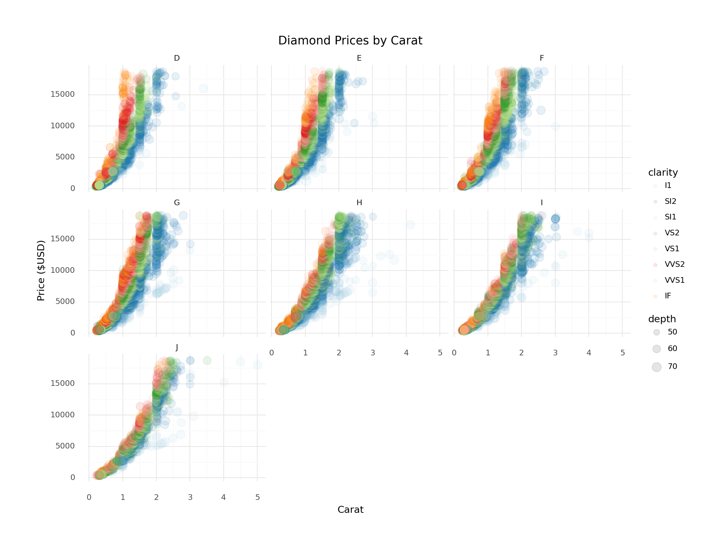

# Visualizing Data with a Grammar of Graphics

## Pre-Class Assignment

1.  Pick a data-driven graphic.
2.  How might the underlying data have been organized? (In other words, if you could access the underlying data for the plot, what do you think its columns might be? What datatypes would those columns be? What might constitute a row?)
3.  What data parameters were mapped onto the graphic?
4.  What visual mappings do you see? (For example, what data is being mapped to the x axis? The y-axis? Color? And so on...)
5.  How would *you* have graphed this data? Would you make different choices? If so, what would they be? Explain why you would make those choices.

------------------------------------------------------------------------

There's lots of stuff to do in Python; let's start with a plot!

## Plotting the `diamonds` dataset

Our first plot is going to make use of the `diamonds` dataset that ships with [`plotnine`](https://github.com/has2k1/plotnine).

We'll import the necessary stuff from `plotnine` first.
It seems like a lot of imports, but I made them all explicit so you can trace which parts of the code come from the `plotnine` library.


```python
from plotnine import aes
from plotnine import facet_wrap
from plotnine import ggtitle
from plotnine import ggplot
from plotnine import geom_point
from plotnine import geom_bar
from plotnine import scale_color_brewer
from plotnine import theme_minimal
from plotnine import xlab
from plotnine import ylab
from plotnine.data import diamonds
import plotnine

plotnine.options.figure_size = (11, 8.5)

(
  ggplot(
    diamonds,
    aes(
      x = 'carat',
      y = 'price',
      color='clarity',
      size = "depth"
    )
  )
  + geom_point(alpha = 0.1)
  + scale_color_brewer(type='qual', palette=3)
  + facet_wrap('~color')
  + theme_minimal()
  + xlab("Carat")
  + ylab("Price ($USD)")
  + ggtitle('Diamond Prices by Carat')
)
#> <ggplot: (8740414110025)>
```



## We can also run R

Below, we'll generate a similar version of the plot we just made in Python, but we'll make this one in R.
We'll need a few different packages to make it work.

As you look at the code and the plot, ask yourself where you spot major differences from the Python version.

*Can you spot any differences?*


```r
library(dplyr)
library(ggplot2)
library(magrittr)
library(scales)

diamonds %>%
  ggplot(aes(carat, price, color = clarity, size = depth)) +
  geom_point(alpha = 0.1) +
  scale_color_brewer(type = 'qual', palette = 3) +
  facet_wrap(~ color) +
  theme_minimal() +
  scale_y_continuous(labels = scales::dollar_format()) +
  labs(caption = "Example: Comparing the size, price, and clarity of 50,000 diamonds")
```


